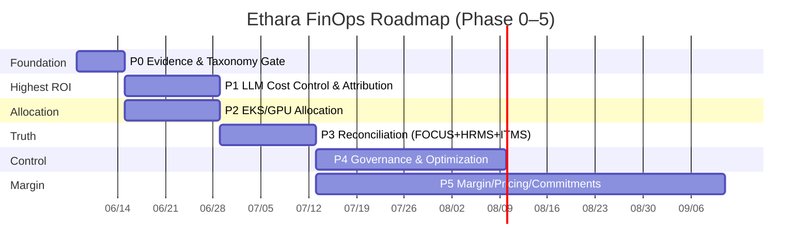
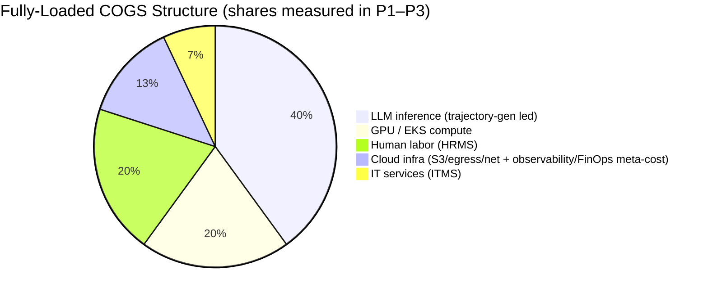
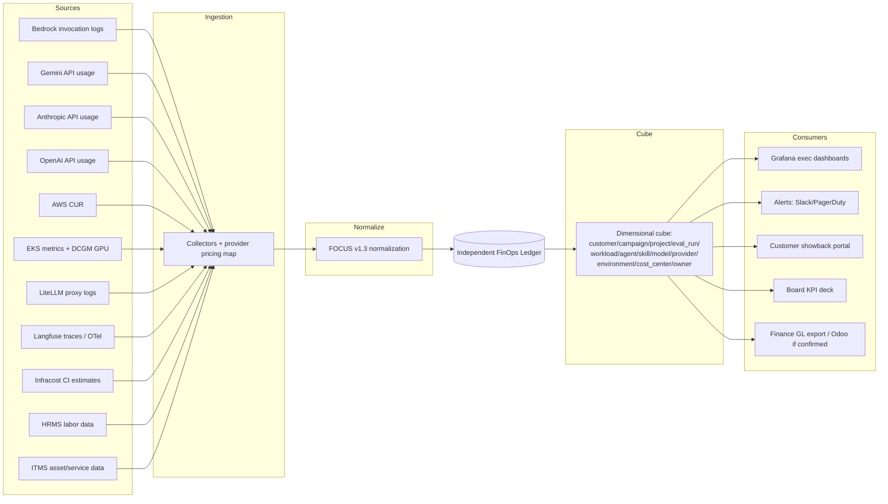
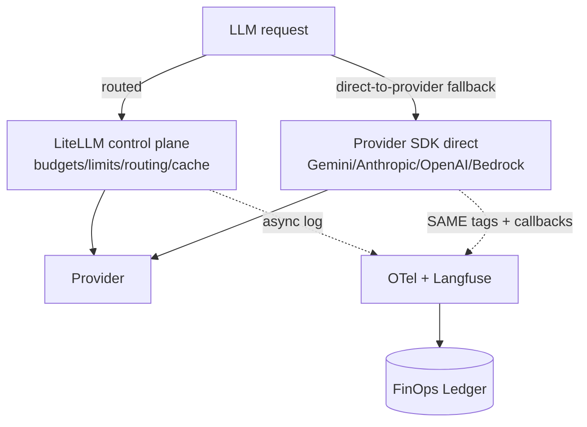
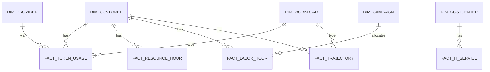

# Ethara.AI FinOps Strategy

> **The world trains AI. We align it.** — and now we will know, to the token and to the labeled item, exactly what that costs.

---

## §0. Front Matter

| Field | Value |
|---|---|
| **Title** | Ethara.AI FinOps Strategy — Multi-Pronged Practice Charter |
| **Version** | 0.1 |
| **Status** | DRAFT (pending FinOps Council review) |
| **Author** | FinOps Practice (orchestrated) |
| **Reviewers** | CFO · VP Engineering · AI Platform Lead · DevOps Lead · Data Engineering Lead · Procurement · Security |
| **Audience** | Board/Investor (§1), Executive (§1–§3, §7), Engineering (§5–§9), SRE/On-call (§10–§11) |
| **Last reviewed** | 2026-06-03 |
| **Distribution** | Internal — Confidential |
| **Supersedes** | `ethara-finops-requirements.md` (requirements → strategy) |

### Document Conventions

- All currency in **USD** unless marked otherwise (₹ for India-local labor/IT where relevant).
- All dates **ISO-8601** (`YYYY-MM-DD`).
- Cost ratios written `$ / unit` (e.g. `$ / 1M tokens`, `$ / labeled item`).
- **Bold** terms resolve in **Appendix B — Glossary**.
- Every quantitative claim carries a citation resolved in **Appendix A — Citations & Source Map**.
- `MUST` / `SHOULD` / `MAY` per RFC-2119 sense.

### Change Log

| Version | Date | Change |
|---|---|---|
| 0.1 | 2026-06-03 | Initial draft. Premise validation, 14 key decisions, 11 capability domains, Phase 0–5 roadmap, provider-agnostic cost model, HRMS/ITMS fully-loaded COGS, all-OSS tooling stack. |

---

## §1. Executive Summary

### The Strategic Bet (one sentence)

> **Ethara will run an AI-native FinOps practice whose source of truth is multi-provider LLM token telemetry (Gemini, Anthropic, OpenAI, Bedrock) plus EKS/GPU allocation plus FOCUS-normalized cloud billing — fused into a single independent cost ledger keyed by customer, campaign, project, and `eval_run`/trajectory — and extended with HRMS human-labor cost and ITMS IT-service cost to produce fully-loaded unit economics per labeled item, per trajectory, and per evaluation.**

### Why now

Ethara is a human-in-the-loop AI alignment company (~922 employees) operating at extreme inference scale — **50+ billion tokens per 4-week campaign**, **1.24M tokens/minute sustained (4–6M peak)**, **1.78B tokens/day**. The dominant operating expense is **LLM usage for trajectory generation**, with evaluation harnesses (LLM-as-judge) compounding it. Yet today we know the *volume* and not the *dollars-per-customer*, the *margin-per-track*, or the *fully-loaded cost-per-labeled-item*. A FinOps practice converts that blindness into a steering wheel.

### What is different about Ethara's FinOps

Standard cloud FinOps counts compute, storage, and egress. Ethara's true **COGS** has **five layers**, and any practice that ignores the last two will understate cost by a wide margin:

1. **LLM inference** (multi-provider token spend — the dominant driver, led by trajectory generation)
2. **GPU compute** (P4d/P5 on EKS for training/RFT/RL environments)
3. **Cloud infrastructure** (EC2, S3, egress, networking, observability)
4. **Human labor** (HRMS — the labelers/annotators/reviewers who make "human-in-the-loop" real)
5. **IT services & assets** (ITMS — endpoints, SaaS seats, internal tooling, service desk)

### North-Star KPIs (≤ 6)

| KPI | Why it is north-star |
|---|---|
| **Blended gross margin %** (by commercial track) | The number the board steers on. |
| **Fully-loaded COGS / credit** (LLM+GPU+cloud+human+IT) | True unit economics, not cloud-only. |
| **$ / trajectory** and **$ / eval_run** | The dominant workloads, made measurable. |
| **$ / 1M tokens served** (by provider) | Provider arbitrage + routing efficiency. |
| **Idle committed-capacity %** (PT / Savings Plans / RI) | Waste made visible (never smeared). |
| **Unallocated cost %** | Trust metric for the whole ledger. |

### The 14 Key Decisions (one-liners)

- **KD1** — LiteLLM is a **staged, non-mandatory** control layer, never a forced all-traffic chokepoint; direct-to-provider paths are first-class and MUST carry the same tags + telemetry.
- **KD2** — **Two-ledger committed-capacity accounting**: on-demand marginal ledger vs committed ledger; idle commitment shown as variance, never silently smeared into unit cost.
- **KD3** — GPU **dollars** come from CUR/FOCUS; OpenCost is an **allocator**, not the financial ledger.
- **KD4** — **Agent-runaway + eval-harness controls ship in Phase 1**, not late governance.
- **KD5** — An **independent FinOps ledger** is the source of truth; Odoo is not assumed to hold finance.
- **KD6** — **Caching + model-routing governance** likely saves more than generic cloud cleanup.
- **KD7** — **All-OSS, self-hosted** tooling; SaaS FinOps (CloudZero/Vantage/Finout) rejected for lock-in.
- **KD8** — **FOCUS v1.3** is the cross-provider normalization standard.
- **KD9** — **Customer isolation** = hybrid (AWS account-per-major-customer for the top tier; tag-per-customer for the rest).
- **KD10** — **Multi-region/DR cost posture** is explicit; PT is region-bound, so failover capacity is a budgeted line.
- **KD11** — **Internal vs external workload separation**: 922-employee internal agent/opencode spend is a first-class workload, ring-fenced from customer inference commitments.
- **KD12** — **Provider-agnostic cost tracking** across Gemini, Anthropic, OpenAI, and Bedrock is mandatory; `provider` is a primary cost dimension, and no architecture may assume a single vendor.
- **KD13** — **Trajectory generation is the primary cost workload** and gets dedicated first-class attribution (`workload=trajectory_gen`), not folding into generic "inference."
- **KD14** — **Fully-loaded unit economics include HRMS (human labor) and ITMS (IT services)**; cloud+LLM-only COGS is explicitly rejected as incomplete.

### Roadmap at a glance



### Investment ask & expected ROI

- **People**: 1 FinOps Lead + 1 FinOps Analyst (Phase 0–1), 1 Cloud Economist (Phase 4). 1–2 embedded FTE per `ethara-finops-requirements.md`.
- **Infra**: self-hosted OSS stack (LiteLLM, Langfuse, OpenCost, Prometheus, Grafana, Cloud Custodian, Infracost) — single-digit % of the bill it governs.
- **Expected ROI** (industry-anchored, to be replaced with measured numbers post-Phase-1): caching + routing governance 15–40% LLM-spend reduction (KD6); Spot already 60–70% on eligible compute; off-hours + idle reclamation 50–70% on dev/test; commitment optimization on the stable floor.

### Explicitly out of scope (this version)

- Odoo native accounting as finance source of truth — **deferred** until accounting modules are confirmed (see §3.1, KD5).
- A first-party Flutter mobile cost surface — **not applicable**; no such app exists (see §3.2).
- SaaS FinOps platforms — **rejected** (KD7).

### Reading guide

| You are… | Read |
|---|---|
| Board / Investor | §1, §3, §7 (Gantt), §12 |
| CFO / Finance | §1, §2, §6.5, §9, §12 |
| Staff Engineer (implementer) | §5, §6, §8, §9, Appendix E |
| SRE / On-call | §10, §11 (runbooks) |
| FinOps practitioner | All; start §2 then §6 |

---

## §2. Key Decisions Registry

> Each decision: **Context → Decision → Rationale → Alternatives Rejected → Reversibility → Owner → Review Cadence → Open Questions → Links.**

### KD1 — LiteLLM is a staged, non-mandatory control layer

- **Context.** Production inference runs at 1.24M TPM sustained / 4–6M peak. A gateway in front of *all* traffic is a reliability risk and, worse, gets bypassed during incidents — producing clean dashboards exactly when spend is most abnormal.
- **Decision.** LiteLLM is deployed as a **staged, opt-in control plane** for routed traffic (budgets, rate limits, routing, caching). It is **never a mandatory all-traffic chokepoint.** Direct-to-provider calls (Gemini, Anthropic, OpenAI, Bedrock) remain first-class and **MUST** carry the same tag schema and emit OTel/Langfuse telemetry.
- **Rationale.** (1) Removes single point of failure. (2) Preserves cost-attribution continuity even on the fallback path. (3) Matches Oracle's explicit warning. (4) Confirmed by stakeholder constraint: *"LiteLLM is not mandatory for all traffic."*
- **Alternatives rejected.** Mandatory universal proxy (reliability + bypass risk); no gateway at all (loses enforcement + caching).
- **Reversibility.** High (can widen or narrow proxy coverage per agent/category).
- **Owner.** AI Platform Lead.
- **Review cadence.** Monthly during rollout, then quarterly.
- **Open questions.** Which agent categories canary first? Caching hit-rate target before broad enablement?
- **Links.** §5 (dual-track), §6.9, §8 (LiteLLM), KD12, KD13.

### KD2 — Two-ledger committed-capacity accounting

- **Context.** Committed capacity (Bedrock **PT**, EC2 Savings Plans, RIs, Capacity Reservations) is a fixed cost regardless of utilization. Smearing idle commitment into per-token cost hides waste and corrupts margin.
- **Decision.** Maintain **two ledgers**: (A) on-demand **marginal** cost per unit, and (B) **committed-capacity** cost. Idle committed capacity is reported as **"unused committed capacity / variance"** — **never** silently averaged into unit cost.
- **Rationale.** Makes commitment waste a first-class, visible KPI; enables honest break-even and margin math.
- **Alternatives rejected.** Blended single rate (hides idle); ignoring commitments (mis-states floor).
- **Reversibility.** Medium (ledger model is foundational).
- **Owner.** FinOps Lead + Finance.
- **Review cadence.** Monthly close.
- **Open questions.** PT commitment term/region mix; Savings Plan coverage target.
- **Links.** §6.5, §9, §12 (idle-commit KPI).

### KD3 — GPU dollars from CUR/FOCUS; OpenCost allocates only

- **Context.** OpenCost has a known custom-GPU pricing limitation for P4d/P5; using it as the financial ledger would misstate GPU dollars.
- **Decision.** GPU **dollar amounts** are sourced from **AWS CUR → FOCUS v1.3**. **OpenCost + Prometheus + DCGM-exporter** provide **allocation ratios** (pod/namespace/GPU-share), which are applied to the authoritative dollars.
- **Rationale.** Separates "who used it" (OpenCost) from "what it cost" (CUR). Avoids a known pricing bug becoming financial error.
- **Alternatives rejected.** OpenCost as ledger (inaccurate GPU $); CUR-only (no pod-level allocation).
- **Reversibility.** High.
- **Owner.** DevOps Lead + Data Engineering.
- **Review cadence.** Quarterly (revisit if OpenCost GPU pricing is fixed).
- **Links.** §6.1, §8 (OpenCost), §9.

### KD4 — Agent-runaway + eval-harness controls ship in Phase 1

- **Context.** Agent loops and LLM-as-judge evaluation are **recursive, compounding** spend. Deferring controls to "governance" is too late at Ethara's scale.
- **Decision.** Phase 1 ships **per-agent budgets, max steps/tokens/tool-calls, retry ceilings, loop detection, kill switches**, and **eval-harness cost tracking** (tag judge model, candidate model, dataset, `eval_run`, retry count, sampling policy).
- **Rationale.** Highest-leverage guardrails; prevents a single runaway from consuming a campaign budget.
- **Alternatives rejected.** Deferring to Phase 4 (exposes budget to runaway in the interim).
- **Reversibility.** High (thresholds tunable).
- **Owner.** AI Platform Lead.
- **Review cadence.** Bi-weekly optimization council.
- **Links.** §6.9, §7 (Phase 1), §11 (R1, R2).

### KD5 — Independent FinOps ledger is the source of truth

- **Context.** Odoo is present only as a **performance/operations** system; no accounting/invoicing modules are confirmed (§3.1).
- **Decision.** Build an **independent FinOps ledger** keyed by canonical dimensions (customer, campaign, project, `eval_run`, …). If/when Odoo accounting is confirmed, integrate it as a **downstream** showback/GL target — not a prerequisite.
- **Rationale.** Avoids blocking FinOps on an unconfirmed billing system; keeps finance truth provider-agnostic.
- **Alternatives rejected.** Assume Odoo accounting (unverified); force finance into Odoo operational module (wrong tool).
- **Reversibility.** Medium.
- **Owner.** FinOps Lead + Data Engineering.
- **Review cadence.** Phase 0 gate + quarterly.
- **Links.** §3.1, §9, §10.

### KD6 — Caching + model-routing governance over generic cleanup

- **Context.** At 50B+ tokens/4wk, prompt/semantic caching and routing the cheapest model meeting SLA dwarf typical "delete idle EBS" savings.
- **Decision.** Prioritize **caching governance** (semantic + prompt cache) and **model routing/cascading** as primary optimization levers; generic cloud cleanup is secondary.
- **Rationale.** Marginal token economics × volume = the biggest lever.
- **Alternatives rejected.** Cloud-cleanup-first (lower ceiling at this token scale).
- **Reversibility.** High.
- **Owner.** AI Platform Lead.
- **Review cadence.** Bi-weekly.
- **Links.** §6.3, §6.9, KD1.

### KD7 — All-OSS, self-hosted tooling

- **Context.** Cost data is strategic; SaaS FinOps creates lock-in and exfiltrates spend telemetry.
- **Decision.** Standardize on **self-hosted OSS**: LiteLLM, Langfuse, OpenLLMetry, Phoenix, OpenCost, Prometheus, Grafana, Cloud Custodian, Infracost (+ FOCUS spec). **Reject** CloudZero, Vantage, Finout.
- **Rationale.** Control, no markup, no lock-in, data residency (KD10), auditability.
- **Alternatives rejected.** SaaS platform of record (lock-in, cost, residency).
- **Reversibility.** Medium (make-or-buy revisited annually).
- **Owner.** FinOps Lead.
- **Review cadence.** Annual make-or-buy.
- **Links.** §8.

### KD8 — FOCUS v1.3 as the normalization standard

- **Context.** Multi-provider billing (AWS + Gemini + Anthropic + OpenAI) is structurally inconsistent.
- **Decision.** Normalize all billing/telemetry to **FOCUS v1.3** (FinOps Foundation, ratified 2025-12-04) before it enters the ledger.
- **Rationale.** Cross-provider comparability; future-proof as AWS/Azure/GCP adopt FOCUS.
- **Alternatives rejected.** Per-provider bespoke schemas (un-comparable).
- **Reversibility.** Low (foundational).
- **Owner.** Data Engineering.
- **Review cadence.** On FOCUS spec releases.
- **Links.** §9, Appendix C.

### KD9 — Customer isolation: hybrid account + tag

- **Context.** Per-customer cost allocation and security isolation must coexist.
- **Decision.** **AWS account-per-customer** (Organizations OU) for the **top tier**; **tag-per-customer** for the rest. Both feed the same ledger.
- **Rationale.** Strong isolation where it matters; low overhead elsewhere.
- **Alternatives rejected.** Tag-only (weaker isolation for large customers); account-per-everything (overhead).
- **Reversibility.** Low once customers onboarded.
- **Owner.** Security + DevOps Lead.
- **Review cadence.** Quarterly + per major-customer onboarding.
- **Open questions.** Tier threshold (revenue? volume?); chargeback envelope per account.
- **Links.** §9, §10, Appendix H.

### KD10 — Multi-region / DR cost posture is explicit

- **Context.** Bedrock **PT is region-bound**; LLM provider availability and **India data residency** vary; failover capacity costs real money.
- **Decision.** Treat DR/failover capacity (including any standby PT) as a **budgeted, named line**; document per-region residency constraints; model failover cost in runbooks.
- **Rationale.** Prevents surprise commitment cliffs and residency violations.
- **Alternatives rejected.** Implicit DR (hidden cost + compliance risk).
- **Reversibility.** Medium.
- **Owner.** DevOps Lead + Security + Finance.
- **Review cadence.** Quarterly.
- **Links.** §11 (R3), Appendix G, Appendix H.

### KD11 — Internal vs external workload separation

- **Context.** ~922 employees run internal agents/opencode TUI, consuming LLM tokens that **compete with customer inference** for the same provider quota/commitments.
- **Decision.** Internal developer/agent spend is a **first-class, ring-fenced workload** (`workload=internal_dev`), with its own budget and dashboards, separated from customer-facing commitments.
- **Rationale.** Prevents internal spend from cannibalizing customer SLA capacity; reveals true internal productivity cost.
- **Alternatives rejected.** Co-mingling (distorts customer unit economics).
- **Reversibility.** High.
- **Owner.** VP Engineering + FinOps Lead.
- **Review cadence.** Monthly.
- **Links.** §6.9, §9, KD13.

### KD12 — Provider-agnostic cost tracking (Gemini, Anthropic, OpenAI, Bedrock)

- **Context.** Stakeholder constraint: project cost must be tracked across **multiple LLM providers — Gemini, Anthropic, OpenAI** — not Bedrock alone.
- **Decision.** `provider` is a **primary cost dimension**. The ingestion + normalization layer ingests native telemetry from **Google (Gemini), Anthropic API, OpenAI, and AWS Bedrock**, normalized via FOCUS v1.3 + a provider pricing map. No component may assume a single vendor.
- **Rationale.** Reflects real multi-provider usage; enables provider arbitrage and routing (KD6); avoids Bedrock-only blind spots.
- **Alternatives rejected.** Bedrock-centric model (under-counts Gemini/OpenAI/Anthropic-direct spend).
- **Reversibility.** Low (foundational to the data model).
- **Owner.** Data Engineering + AI Platform Lead.
- **Review cadence.** On provider-pricing changes (pricing map versioned).
- **Open questions.** Per-provider invocation-log access + export cadence; custom/fine-tuned model pricing upkeep.
- **Links.** §6.9, §9, Appendix C, KD1.

### KD13 — Trajectory generation is the primary cost workload

- **Context.** Stakeholder constraint: *"The major expenditure is LLM usage for trajectory generation."*
- **Decision.** `workload=trajectory_gen` is a **first-class workload dimension** with dedicated budgets, dashboards, and unit economics (**$ / trajectory**). Eval-harness (LLM-as-judge) is a **distinct** first-class workload to avoid conflation.
- **Rationale.** You cannot optimize what you cannot see; the dominant cost must be its own line, not folded into generic inference.
- **Alternatives rejected.** Generic "inference" bucket (hides the dominant driver).
- **Reversibility.** High.
- **Owner.** AI Platform Lead + Research.
- **Review cadence.** Weekly trend + bi-weekly optimization.
- **Links.** §6.5, §6.9, §9, §12.

### KD14 — Fully-loaded unit economics include HRMS + ITMS

- **Context.** Stakeholder constraint: *"keep HRMS and ITMS in mind for cost calculations."* As a human-in-the-loop company, **labeler/annotator labor (HRMS)** and **IT services/assets (ITMS)** are real **COGS**, not overhead to ignore.
- **Decision.** The cost ledger ingests **HRMS** (labor cost, time-tracking, allocation to campaign/project) and **ITMS** (IT assets, SaaS seats, service-desk/MSP, endpoint costs). **Fully-loaded COGS = LLM + GPU + cloud + human (HRMS) + IT (ITMS).** Cloud+LLM-only COGS is explicitly rejected as incomplete.
- **Rationale.** Human labor is often the largest single COGS line in human-in-the-loop labeling; omitting it makes margin fiction. ITMS captures the IT cost of running 922 employees.
- **Alternatives rejected.** Cloud+LLM-only (understates true cost-per-labeled-item / per-trajectory dramatically).
- **Reversibility.** Medium (requires HRMS/ITMS data integration).
- **Owner.** FinOps Lead + Finance + People Ops + IT.
- **Review cadence.** Monthly close.
- **Open questions.** Which HRMS (e.g., Indian payroll system) and ITMS (ITSM/asset tool) are in use? Granularity of labor time-tracking to campaign/`eval_run`? Cost-allocation method for shared labor.
- **Links.** §6.5, §9 (`fact_labor_hour`, `fact_it_service`), §10.

---

## §3. Premise Validation & Honest Framing

> We validated the requested Odoo/Flutter premise against current evidence. **Odoo and Flutter are not confirmed as financial or product cost systems; therefore they are treated as integration candidates, not FinOps foundations.** What follows pivots to the real source of truth — multi-provider LLM telemetry + EKS/GPU + FOCUS-normalized billing + HRMS + ITMS.

### 3.1 Odoo — operations, not (yet) accounting

- **What exists.** The only Odoo material in the knowledge base is the **`Odoo Performance DevOps Playbook.md`** — a *generic* performance/scaling playbook (Odoo 15–18 on Kubernetes, PostgreSQL + PgBouncer, S3 filestore, worker sizing formula, OOMKill avoidance, Spot, storage tiering). It returned **39 content hits, with zero accounting/invoice/subscription semantics.**
- **What FinOps needs from an ERP.** General Ledger, Accounts Receivable/Payable, tax engine, subscription/usage billing, analytic accounting / cost centers — **none of which are documented as in use.**
- **Verdict.** Odoo is an **operations/task-management** system today. It is an **integration candidate** for downstream showback/GL *if and when* accounting modules are confirmed. Until then, finance truth lives in the **independent FinOps ledger** (KD5).
- **Action (Phase 0).** Audit the live Odoo instance: version, installed-modules list, schema, `odoo.conf`. Confirm or deny accounting/billing presence.

### 3.2 Flutter — no first-party app found

- **What exists.** **No first-party Ethara Flutter codebase** is present in the knowledge base. "Flutter" keyword hits are **LLM-trajectory noise** (in `unified-personas/`, `freya/`, `kaiju/`), not an application.
- **Actual frontend surface.** **Astro v6 + Tailwind v4** (`leviathan/pete-rebuild/`, Node ≥ 22.12) for web, plus the **opencode TUI** as the primary internal interface.
- **Implication.** There is **no mobile-app cost surface** to govern. The cost surfaces that matter are: the **agent runtime** (token spend), the **web** frontend, and the **TUI**. If a Flutter app appears later, instrument it for **customer/session metadata only** — it is not a cost driver in itself.

### 3.3 The pivot

The FinOps foundation is therefore the **real cost engine**:

> **Multi-provider LLM inference (led by trajectory generation) → GPU/EKS compute → cloud infra (S3/egress/networking/observability) → human labor (HRMS) → IT services (ITMS)**, all normalized to FOCUS v1.3 and attributed through an independent ledger keyed by canonical cost dimensions.

---

## §4. Current-State Cost Reality

### 4.1 Scale (the cost drivers)

| Metric | Value | Source |
|---|---|---|
| Tokens / 4-week campaign | **50+ billion** | `Ethara-AI-AWS-Impact.md`, `Ethara-AWS-Bedrock-Investor-Slide.md` |
| Sustained throughput | **1.24M TPM** | `Ethara-AI-AWS-Impact.md` |
| Peak throughput | **4–6M TPM** | `Ethara-AI-AWS-Impact.md` |
| Daily volume | **1.78B tokens/day** | `Ethara-AI-AWS-Impact.md` |
| Tokens / eval attempt | **~700K** | `Ethara-AI-AWS-Impact.md` |
| Eval attempts / campaign | **70K+** | `Ethara-AI-AWS-Impact.md` |
| Model-question pairs | **210K+** | `Ethara-AI-AWS-Impact.md` |
| Spot savings | **60–70%** | `Ethara-AI-AWS-Impact.md` |
| Idle EC2 reduction (post-EKS) | **70%+** | `Ethara-AI-AWS-Impact.md` |
| Autoscaling+Spot efficiency | **40–60%** | `Ethara-AI-AWS-Impact.md` |
| Headcount | **~922 employees** | `ETHARA_AI_COMPREHENSIVE_FINDINGS.md` |
| Competitive COGS/credit | **$0.10–1.00+** | `Emergent_Strategic_Assessment_April_2026.md` |
| Infra at 30K concurrent pods | **$2–5M+/mo** | `Emergent_Strategic_Assessment_April_2026.md` |

### 4.2 Model / provider inventory

**Provider-agnostic (KD12).** Active and candidate providers:

| Provider | Models | Mode |
|---|---|---|
| **AWS Bedrock** | Claude (Opus / Sonnet / Haiku), Zhipu GLM, Moonshot Kimi, Amazon Nova 2 Lite (RFT target) | **PT** (Provisioned Throughput) + On-Demand |
| **Anthropic (direct)** | Claude family | On-Demand API |
| **Google** | **Gemini** | On-Demand API |
| **OpenAI** | GPT family | On-Demand API |

> **PT vs ODT** split is the heart of KD2's two-ledger model: PT = committed floor; ODT/burst = marginal.

### 4.3 Infrastructure topology

- **EKS** clusters; **EC2 P4d/P5** (GPU) + **C-series** (CPU) + **Spot** (60–70% of eligible).
- **S3** (datasets, filestore), **ECR** (agent/skill images), **egress** (S3/NAT/inter-AZ/PrivateLink — a sleeper top-3 line, §6.3).
- **AWS MAP credits** (sub-linear scaling) via **ShellKode** partner.
- Multi-AZ; DR/region posture per KD10.

### 4.4 Cost-engine waterfall (structure; percentages to be measured in Phase 1–3)



> Shares are **illustrative placeholders** pending measurement; the point is the **five-layer structure** (KD14) — LLM, GPU, cloud, human, IT — not the numbers. Observability and FinOps meta-cost (the cost of running the FinOps tooling itself, §6.7) are carried inside the **cloud-infra** layer rather than as a sixth COGS layer. Phase 3 replaces these with measured values that sum to 100%.

### 4.5 Workload taxonomy (maps 1:1 to the `workload` dimension)

| Workload | Notes |
|---|---|
| **`trajectory_gen`** | **Dominant cost** (KD13). RL/agent trajectory generation. |
| **`eval_harness`** | LLM-as-judge; recursive (KD4). |
| **`rlhf` / `sft`** | Training/fine-tuning runs (GPU-heavy). |
| **`rl_environments`** | Marketplace RL environments (commercial track T2). |
| **`agent_runtime`** | Production agent inference. |
| **`internal_dev`** | 922-employee opencode/agent spend (KD11). |

---

## §5. Target FinOps Architecture

### 5.1 Logical architecture



### 5.2 Dual-track tracking (KD1, KD12)



> **Invariant.** The fallback path carries the **same tag schema** and emits the **same telemetry** as the proxied path. Otherwise dashboards look clean exactly when the system is degraded.

### 5.3 Three telemetry paths

| Path | Purpose | Components | Latency tolerance |
|---|---|---|---|
| **HOT** | Request-level guardrails (budgets, kill switch) | LiteLLM + SDK callbacks | ms |
| **WARM** | Attribution + dashboards | Langfuse + OpenLLMetry/OTel | seconds–minutes |
| **COLD** | Financial reconciliation vs invoices/PT | CUR → FOCUS + provider invoices + HRMS/ITMS | hours–daily |

### 5.4 Two-ledger PT model (KD2)

```mermaid
flowchart LR
    subgraph Ledger A — Marginal
        M[On-demand / burst $ per unit]
    end
    subgraph Ledger B — Committed
        K[PT / Savings Plans / RI fixed $]
        V[Idle = unused committed capacity \(variance\)]
    end
    M --> U[Unit economics]
    K --> U
    V --> W[Waste KPI — never smeared into U]
```

### 5.5 Data SLAs & failure-mode matrix

| Source down | Degraded behavior | Mitigation |
|---|---|---|
| LiteLLM proxy | Traffic falls back direct-to-provider | SDK callbacks keep attribution (KD1) |
| Langfuse | WARM dashboards stale | HOT guardrails unaffected; backfill from logs |
| CUR/FOCUS late | COLD reconciliation delayed | Use WARM estimates with variance band |
| HRMS/ITMS export late | Fully-loaded COGS partial | Show cloud+LLM COGS + flagged "labor/IT pending" |
| Provider usage API down | Per-provider spend gap | Reconcile from invoices in COLD path |

---

## §6. Capability Domains

> Eleven domains (the nine from `ethara-finops-requirements.md` + Sustainability + the explicit HRMS/ITMS Human-&-IT-Cost domain). Each uses the micro-template: **Definition · Why at Ethara · Current maturity · Target maturity · Capabilities · Inputs/Outputs · Owner · KPIs · Phase · Tooling · Risks.**

### 6.1 Visibility & Cost Allocation

- **Definition.** Unified, near-real-time cost telemetry attributed across all canonical dimensions.
- **Why at Ethara.** Today volume is known; dollars-per-customer/campaign/`eval_run` are not.
- **Current maturity.** *Crawl.* **Target.** *Run* by Q3.
- **Capabilities.** Multi-provider token attribution (KD12); GPU allocation (KD3); tagging standard (Appendix D); showback/chargeback; **anomaly management as an explicit sub-capability** (per-agent/per-customer/per-`eval_run` anomalies, not just CUR-level).
- **Inputs.** LiteLLM logs, provider usage APIs, CUR/FOCUS, DCGM, HRMS/ITMS. **Outputs.** Unit-economics dashboards, unallocated-cost %.
- **Owner.** FinOps Lead. **KPIs.** Unallocated cost %, tag-compliance %, anomaly MTTR.
- **Phase.** P1 (LLM), P2 (GPU), P3 (full reconciliation). **Tooling.** §8. **Risks.** Untagged spend → allocation gaps.

### 6.2 Budgeting & Forecasting

- **Definition.** Tiered budgets with alerts + AI-workload-aware forecasts.
- **Why at Ethara.** Campaign-driven, bursty token demand; commitment planning needs forecasts.
- **Current maturity.** *Crawl.* **Target.** *Walk→Run* by Q3.
- **Capabilities.** Budgets with **50/80/100/120%** alerts; **methodology = bottom-up unit-economics × volume + top-down growth** (Prophet/ARIMA/regression); **4–12-week rolling horizon + variance bands**; commitment planning (PT/Savings Plans).
- **Owner.** FinOps Lead + Finance. **KPIs.** Budget-burn variance, forecast accuracy (MAPE).
- **Phase.** P1 (budgets), P5 (commitments). **Tooling.** LiteLLM budgets, Grafana, ledger. **Risks.** Bursty campaigns break naive linear forecasts.

### 6.3 Optimization

- **Definition.** Workload + rate + architectural cost optimization.
- **Why at Ethara.** Token economics × volume = the biggest lever (KD6).
- **Capabilities.** **Caching governance** (semantic + prompt) and **model routing/cascading** (KD6); **rate optimization** (Spot, Savings Plans, RI, Bedrock PT) as a **joint commitment portfolio**; **GPU arbitrage** (P5 vs P4d × on-demand vs Spot × Capacity Reservations/Blocks); **Spot-interruption cost modeling** (re-run/restart penalties); **egress reduction** (S3/NAT/inter-AZ/PrivateLink); storage tiering; off-hours scheduling.
- **Owner.** AI Platform Lead + DevOps. **KPIs.** Cache hit-rate, $/1M tokens by provider, Spot coverage %, idle-commit %.
- **Phase.** P4 (governance-driven), continuous. **Tooling.** LiteLLM cache, Cloud Custodian, Infracost. **Risks.** Over-aggressive routing degrades quality SLA.

### 6.4 Governance & Policy

- **Definition.** Pre-deploy + runtime cost controls as policy-as-code.
- **Capabilities.** Tag enforcement (Appendix D); Cloud Custodian fleet (off-hours, orphaned-EBS/S3 GC); Infracost CI gates; quota/rate limits; anomaly detection with paging; egress monitoring; **RBAC for FinOps tooling**; **auditability-as-git-commits** (every Custodian/LiteLLM policy change is a commit → SOC2 evidence).
- **Owner.** DevOps Lead + Security. **KPIs.** Tag-compliance %, policy-violation count, % spend behind a budget.
- **Phase.** P4. **Tooling.** Cloud Custodian, Infracost. **Risks.** Policy gaps create ungoverned spend.

### 6.5 Margin, Pricing & Unit Economics

- **Definition.** COGS instrumentation → margin → pricing.
- **Why at Ethara.** Competitive COGS/credit is $0.10–1.00+; margin is the board metric.
- **Capabilities.** **Two-ledger PT accounting** (KD2); **fully-loaded COGS = LLM+GPU+cloud+HRMS+ITMS** (KD14); the **5 commercial tracks → margin formulas** (T1 per-pilot+license; T2 Marketplace per-task-hour, fee tiers 20%/3%/2%/1.5%; T3 Nova-2 reward-pack license; T4 Kiro design-partner+pipeline; T5 eval-harness MILO-Bench template+per-eval); **AgentCore Evaluations pass-through** (KD12-adjacent: $0.0024/1K input + $0.012/1K output built-in, or $1.50/1K custom) — pass-through vs cost-plus decision; pricing simulator; break-even by track; **cost-per: trajectory (KD13), eval, token, RFT-job, labeled-item, agent-step**.
- **Owner.** FinOps Lead + Finance + Product. **KPIs.** Blended gross margin %, fully-loaded COGS/credit, $/trajectory, $/eval_run, $/labeled-item.
- **Phase.** P5. **Tooling.** Ledger, Grafana. **Risks.** Omitting HRMS/ITMS → fictional margin.

### 6.6 Operational Cadence

- **Definition.** The drumbeat that keeps cost in the loop.
- **Capabilities.** Daily anomaly triage; weekly trend review; bi-weekly optimization council; monthly close; quarterly business review; cost-incident process.
- **Owner.** FinOps Lead. **KPIs.** Anomaly MTTR, action-closure rate. **Phase.** P1→ongoing. **Tooling.** Grafana, Slack/PagerDuty. **Risks.** Cadence decay → drift.

### 6.7 Tooling

- **Definition.** Governance of the FinOps toolchain itself.
- **Capabilities.** Versioning, upgrade policy, on-call for the stack; **observability meta-cost** (Langfuse storage growth, Prometheus retention, CloudWatch ingestion); make-or-buy revisit (KD7).
- **Owner.** DevOps Lead. **KPIs.** Tool uptime, cost-of-FinOps-itself %. **Phase.** P0→ongoing. **Tooling.** §8. **Risks.** The observability stack becomes its own cost center.

### 6.8 Organizational & Cultural

- **Definition.** People, accountability, and culture of cost ownership.
- **Capabilities.** FinOps Council; embedded FTE; cost in engineering OKRs; training/cert; **FFF v2 maturity ladder per domain** (Crawl/Walk/Run). See §10.
- **Owner.** CFO + VP Eng. **KPIs.** Maturity score per domain, % squads with cost OKR. **Phase.** P0→ongoing. **Risks.** FinOps stays a tooling project, not a culture.

### 6.9 AI-Specific (the largest domain)

- **Definition.** The cost controls unique to an AI-native, multi-provider, human-in-the-loop business.
- **Capabilities.**
  - **Multi-provider cost telemetry** (Gemini/Anthropic/OpenAI/Bedrock — KD12).
  - **Trajectory-generation cost** as first-class (KD13): `$ / trajectory`, per customer/campaign.
  - **Agent-runaway controls** (KD4): max steps/tokens/tool-calls, retry ceilings, loop detection, per-agent budgets, kill switches.
  - **Eval-harness cost tracking**: tag judge model, candidate model, dataset, `eval_run`, retry count, sampling policy; LLM-as-judge recursion budget.
  - **Semantic + prompt caching** governance (KD6).
  - **Model routing/cascading** (cheapest model meeting SLA).
  - **PT vs ODT** economics; **latency-optimized PT SKU** tradeoff.
  - **RFT/fine-tune ROI** (Nova 2 Lite) vs RAG vs prompt-engineering framework.
  - **Bedrock Knowledge Bases / Guardrails / Agents** cost (separately billed).
  - **Embeddings + vector-DB** cost (Titan/Cohere; OpenSearch/pgvector/Pinecone).
  - **Prompt-token waste** (verbose system prompts at 11-agent scale).
  - **Observability meta-cost** + **model deprecation/migration cost** (re-validate evals on version bumps).
  - **Internal-dev spend** ring-fenced (KD11).
- **Owner.** AI Platform Lead + Research. **KPIs.** $/trajectory, $/eval_run, cache hit-rate, runaway incidents, internal-vs-external token split. **Phase.** P1 (controls), continuous. **Risks.** Recursive eval/agent spend; pricing-map staleness for custom models.

### 6.10 Sustainability & GreenOps (proposed)

- **Definition.** Carbon-aware cost management.
- **Capabilities.** AWS Customer Carbon Footprint Tool; carbon-per-token; carbon-aware region selection; Spot's efficiency narrative; ESG reporting hooks.
- **Owner.** DevOps Lead + Sustainability sponsor. **KPIs.** gCO₂e/1M tokens, % low-carbon-region compute. **Phase.** P4→ongoing. **Risks.** Carbon vs latency/residency tradeoffs.

### 6.11 Human & IT Cost (HRMS + ITMS) — KD14

- **Definition.** Treating **human labor (HRMS)** and **IT services/assets (ITMS)** as first-class COGS components.
- **Why at Ethara.** Human-in-the-loop labeling means **labeler/annotator/reviewer labor is often the single largest COGS line**; 922 employees generate material IT cost.
- **Capabilities.**
  - **HRMS integration**: labor cost, time-tracking, allocation of labeler hours to `campaign`/`project`/`eval_run`; cost-per-labeled-item (labor component); shift/utilization analytics.
  - **ITMS integration**: IT asset inventory, SaaS-seat cost, service-desk/MSP cost, endpoint cost, internal-tooling cost.
  - **Fully-loaded blending**: join `fact_labor_hour` + `fact_it_service` with cloud/LLM facts to produce true unit economics.
- **Inputs.** HRMS export (payroll/time), ITMS/ITSM export (assets/seats/tickets). **Outputs.** Fully-loaded COGS/credit, labor-vs-compute cost mix.
- **Owner.** FinOps Lead + People Ops + IT + Finance. **KPIs.** Labor cost / labeled-item, IT cost / employee, human-vs-compute COGS ratio.
- **Phase.** P3 (integration) → P5 (margin). **Tooling.** HRMS/ITMS connectors → ledger. **Risks.** Data-granularity gaps (labor not tracked to campaign); PII in HR data (Appendix H).

---

## §7. Phased Roadmap

> Per phase: **Objective · Pre-conditions · Workstreams · Deliverables · Acceptance · Owner · Exit gate · Risks · Rollback.**

### Phase 0 — Evidence & Taxonomy Gate (wk 0–1)

- **Objective.** Establish ground truth and the canonical taxonomy.
- **Pre-conditions.** Stakeholder sign-off on KD1–KD14.
- **Workstreams.** (1) Audit Odoo (confirm/deny accounting) + confirm no Flutter (§3). (2) Define **12 core canonical dimensions** (+ `trajectory_id` ledger extension); set `workload` enum (incl. `trajectory_gen`, `internal_dev`). (3) Enable AWS **CUR → FOCUS v1.3** export. (4) Inventory provider usage-API access (Gemini/Anthropic/OpenAI/Bedrock). (5) Identify HRMS + ITMS systems and export feasibility (KD14).
- **Deliverables.** Taxonomy doc; FOCUS export live; provider-access matrix; HRMS/ITMS source inventory.
- **Acceptance.** CUR→FOCUS rows queryable; usage-API access confirmed for **every active provider** — at minimum Gemini, Anthropic, OpenAI, and Bedrock (any provider with zero production spend recorded as a documented exception); Odoo/Flutter verdict recorded.
- **Owner.** FinOps Lead. **Exit gate.** Taxonomy frozen. **Risks.** Provider API access gaps. **Rollback.** N/A (read-only).

### Phase 1 — LLM Cost Control & Attribution [HIGHEST ROI] (wk 1–3)

- **Objective.** See and control the dominant cost (trajectory generation) across providers.
- **Pre-conditions.** Phase 0 taxonomy.
- **Workstreams.** (1) Deploy LiteLLM **staged/HA** (multi-AZ, Redis/Postgres HA, async logging) — **non-mandatory** (KD1). (2) Instrument **dual-track** telemetry (proxy + SDK callbacks) for **all four providers** (KD12). (3) Ship **agent-runaway controls + kill switches** (KD4). (4) Ship **eval-harness cost tracking** (KD4). (5) First-class **`trajectory_gen` attribution** + `$ / trajectory` dashboard (KD13). (6) Budgets with 50/80/100/120% alerts. (7) Ring-fence `internal_dev` (KD11).
- **Deliverables.** Per-provider token/cost dashboards; runaway kill switch; eval-cost dashboard; trajectory unit-cost; budget alerts.
- **Acceptance.** ≥95% of LLM spend attributed to customer+workload+provider **per active provider** (not only in aggregate); kill switch demonstrated; $/trajectory visible.
- **Owner.** AI Platform Lead. **Exit gate.** Per-provider attribution ≥95% for every active provider. **Risks.** Fallback path missing tags (mitigate: invariant in §5.2). **Rollback.** Disable proxy routing; SDK telemetry persists.

### Phase 2 — EKS/GPU Allocation (wk 2–4, parallel with P1)

- **Objective.** Allocate GPU/EKS cost to namespaces/workloads.
- **Workstreams.** (1) OpenCost + Prometheus + DCGM-exporter. (2) Reconcile GPU **$ from CUR/FOCUS** (KD3). (3) Map pods→`workload`/`customer`.
- **Deliverables.** GPU/namespace allocation dashboard reconciled to CUR.
- **Acceptance.** OpenCost allocation ratios applied to CUR dollars; variance < agreed threshold.
- **Owner.** DevOps Lead. **Exit gate.** GPU $ reconcile. **Risks.** OpenCost GPU-pricing bug (mitigated by KD3). **Rollback.** Fall back to CUR-only allocation.

### Phase 3 — Reconciliation Layer (incl. HRMS + ITMS) (wk 3–5)

- **Objective.** One ledger, fully-loaded.
- **Workstreams.** (1) FOCUS v1.3 normalization across providers + AWS. (2) Reconcile telemetry vs invoices vs PT. (3) **Integrate HRMS labor + ITMS IT cost** (KD14). (4) Replace §4.4 placeholder waterfall with **measured** shares.
- **Deliverables.** Independent ledger with fully-loaded COGS; measured cost waterfall (sums to 100%).
- **Acceptance.** Ledger reconciles to invoices within tolerance; labor + IT cost present in COGS.
- **Owner.** Data Engineering + FinOps Lead. **Exit gate.** Fully-loaded COGS live. **Risks.** HRMS/ITMS granularity. **Rollback.** Ship cloud+LLM COGS with labor/IT flagged pending.

### Phase 4 — Governance & Optimization (wk 4–8)

- **Objective.** Enforce + save.
- **Workstreams.** (1) Cloud Custodian fleet (off-hours, GC, tag enforcement, Spot targets, c7n-org). (2) Infracost CI gates. (3) Caching + routing governance (KD6). (4) GreenOps (§6.10).
- **Deliverables.** Policy-as-code repo; CI cost gate; cache/routing savings report.
- **Acceptance.** Tag-compliance ≥ target; CI gate blocks over-budget IaC; measurable cache hit-rate.
- **Owner.** DevOps Lead. **Exit gate.** Policies enforced. **Risks.** SLA regressions from routing. **Rollback.** Revert policy commits (auditable).

### Phase 5 — Margin, Pricing & Commitments (ongoing)

- **Objective.** Turn cost truth into margin and pricing decisions.
- **Workstreams.** (1) Two-ledger PT accounting (KD2). (2) Commitment portfolio (PT/Savings Plans/RI). (3) Margin formulas per commercial track + AgentCore pass-through (KD12-adjacent). (4) Pricing simulator + break-even. (5) Customer showback/chargeback portal. (6) RFT/caching ROI.
- **Deliverables.** Margin dashboard by track; pricing simulator; commitment plan; showback portal.
- **Acceptance.** Board can see gross margin by track; commitment idle % tracked.
- **Owner.** FinOps Lead + Finance + Product. **Exit gate.** Margin steering live. **Risks.** Commitment cliffs (KD10, Appendix G). **Rollback.** Reduce commitment renewals.

**Critical path.** `P0 → P1 → P3 → P5` (P2 parallel; P4 after P3).

---

## §8. Tooling Stack — Reference Architecture

> Per tool: **Role · License · Why-not-SaaS · Self-host/HA · Integration · Failure modes · Cost-of-tool.**

| Tool | Role | License | Self-host / HA | Integration | Failure mode |
|---|---|---|---|---|---|
| **LiteLLM** | Staged control plane: budgets, routing, caching, per-key/user/team/tag budgets (KD1) | MIT | Multi-AZ replicas, Redis + Postgres HA, async logging | Proxies/observes all 4 providers; emits OTel/Langfuse | If down → direct-to-provider fallback (SDK keeps tags) |
| **Langfuse** | WARM attribution: tokens/cost/latency, per-user/session, native cost inference | MIT | Postgres + ClickHouse HA | Receives proxy + SDK callbacks | Stale dashboards; backfill from logs |
| **OpenLLMetry / Traceloop** | OTel instrumentation (backend-agnostic) | Apache-2.0 | Stateless collectors | Exports to Langfuse/Grafana/SigNoz | No built-in cost calc (backend computes) |
| **Phoenix / Arize** | Eval framework (LLM-as-judge + code evaluators) | Apache-2.0 | Self-host | Eval traces → ledger (eval cost) | No native cost (compute in ledger) |
| **OpenCost + Prometheus + DCGM-exporter** | K8s/GPU **allocation** ratios (KD3) | Apache-2.0 | Prometheus HA, remote-write | Allocation × CUR dollars | Custom-GPU pricing bug → allocation-only |
| **Cloud Custodian (c7n + c7n-org)** | Policy-as-code governance | Apache-2.0 | Lambda/periodic; git-tracked | Off-hours, GC, tag enforce, multi-account | Reactive/post-deploy only |
| **Infracost** | Pre-deploy IaC cost gates | Apache-2.0 | CI runner + IDE | GitHub Actions gate | Estimates, not running cost |
| **Grafana** | Dashboards | AGPL/Apache | HA | Reads ledger/Prometheus | No FinOps logic (custom dashboards) |
| **Komiser** | **DEMOTED** — optional multi-cloud inventory | NOASSERTION | Self-host | Inventory only | No pod allocation, limited forecasting |
| **FOCUS v1.3** | Normalization **standard** (not a tool) | CC BY 4.0 | n/a | Schema for ledger | Provider FOCUS adoption lag |
| **HRMS / ITMS connectors** | Labor + IT cost ingestion (KD14) | (internal) | Scheduled export | → ledger fact tables | Granularity/PII (Appendix H) |

### SaaS rejected (KD7) — lock-in scoring

| SaaS | Why rejected | Lock-in |
|---|---|---|
| CloudZero | Cost-data exfiltration, markup, residency | High |
| Vantage | Lock-in, less control over AI/token model | High |
| Finout | Lock-in, SaaS dependency for strategic data | High |

---

## §9. Cost-Attribution Data Model

### 9.1 Canonical dimensions (12 core + `trajectory_id` extension)

> The **12 core** canonical dimensions are listed below. `trajectory_id` is a **non-core ledger extension** (nullable, populated only when `workload = 'trajectory_gen'`); it is the trajectory-grain key, not a 13th core dimension. See `fact_trajectory` (§9.2) and Appendix C/D.


| Dimension | Type | Cardinality | Nullable | Example |
|---|---|---|---|---|
| `customer` | string | hundreds | no (allocate "shared" else) | `acme` |
| `campaign` | string | hundreds | yes | `q3-alignment` |
| `project` | string | hundreds | yes | `milo-bench` |
| `eval_run` | string | thousands | yes | `er_2026_0a3f` |
| `trajectory_id` | string | millions | yes (set when `workload=trajectory_gen`) | `tr_2026_9c14` |
| `workload` | enum | ~6 | no | `trajectory_gen` |
| `agent` | string | ~11+ | yes | `prometheus` |
| `skill` | string | dozens | yes | `deploy-model` |
| `model` | string | dozens | no | `claude-opus` |
| `provider` | enum | 4+ | no | `gemini` / `anthropic` / `openai` / `bedrock` |
| `environment` | enum | ~4 | no | `prod` |
| `cost_center` | string | dozens | no | `cc-research` |
| `owner` | string | hundreds | no | `team-rl` |

### 9.2 Fact tables

- `fact_token_usage` (provider, model, workload, customer, campaign, project, eval_run, **trajectory_id**, agent, skill, input_tokens, output_tokens, cached_tokens, cost_usd, ts)
- `fact_resource_hour` (resource_id, instance_type [P4d/P5/C], gpu_share, namespace, workload, customer, **campaign, project**, hours, cost_usd, ts)
- `fact_storage_byte_day` / `fact_egress_byte` (S3/NAT/inter-AZ/PrivateLink — customer, campaign, project, workload, bytes, cost_usd, ts)
- **`fact_labor_hour`** (HRMS — employee_role, **customer**, campaign, project, eval_run, **workload**, hours, loaded_rate, cost_usd, ts) — KD14
- **`fact_it_service`** (ITMS — asset/seat/service, cost_center, owner, **customer (or `shared`), campaign, workload (or `shared`)**, cost_usd, period) — KD14
- **`fact_trajectory`** (trajectory grain — **trajectory_id**, customer, campaign, project, eval_run, workload=`trajectory_gen`, status, ts) — authoritative **trajectory count** source; `$ / trajectory` is computed against `COUNT(*)` here, never against `eval_run`

> **Join discipline (KD-data).** Facts are at different grains; never join fact-to-fact directly (it multiplies cost). Pre-aggregate each fact to a common allocation grain (`customer, campaign, project, workload, period`) into a **`cost_allocation_bridge`** CTE, then sum. Cloud-infra facts (`fact_resource_hour`, `fact_storage_byte_day`, `fact_egress_byte`) and `fact_it_service` are allocated to customer/campaign by usage share where not natively tagged.

### 9.3 Star schema



### 9.4 Allocation, late data, PII

- **Allocation (KD9).** Account-per-major-customer (top tier) + tag-per-customer (rest); both → ledger.
- **Late-arriving data.** Append with event-time; nightly restatement window; variance band on COLD path.
- **PII.** LLM traces + HRMS data may contain PII → redaction in Langfuse, restricted ledger views (Appendix H).

### 9.5 Sample query

```sql
-- Fully-loaded cost per trajectory, by customer, last 7 days (KD14: LLM+GPU+cloud+human+IT).
-- Pre-aggregate every fact to the customer grain BEFORE combining (no fact-to-fact joins).
WITH llm AS (
  SELECT customer, SUM(cost_usd) AS c
  FROM fact_token_usage
  WHERE workload = 'trajectory_gen' AND ts >= now() - INTERVAL '7 days'
  GROUP BY customer
),
compute AS (
  SELECT customer, SUM(cost_usd) AS c
  FROM fact_resource_hour
  WHERE workload = 'trajectory_gen' AND ts >= now() - INTERVAL '7 days'
  GROUP BY customer
),
cloud AS (  -- storage + egress, allocated to the trajectory_gen workload (KD-data: pre-allocate shared infra before rollup)
  SELECT customer, SUM(cost_usd) AS c FROM (
    SELECT customer, workload, cost_usd, ts FROM fact_storage_byte_day
    UNION ALL SELECT customer, workload, cost_usd, ts FROM fact_egress_byte
  ) x WHERE workload = 'trajectory_gen' AND ts >= now() - INTERVAL '7 days'
  GROUP BY customer
),
labor AS (  -- HRMS, restricted to trajectory_gen labor (e.g. annotators/reviewers on trajectory work)
  SELECT customer, SUM(cost_usd) AS c
  FROM fact_labor_hour
  WHERE workload = 'trajectory_gen' AND ts >= now() - INTERVAL '7 days'
  GROUP BY customer
),
it AS (     -- ITMS, allocated to trajectory_gen ('shared' IT pre-allocated to workloads upstream by usage share)
  SELECT customer, SUM(cost_usd) AS c
  FROM fact_it_service
  WHERE workload = 'trajectory_gen' AND period >= now() - INTERVAL '7 days'
  GROUP BY customer
),
traj AS (   -- authoritative trajectory COUNT (not eval_run)
  SELECT customer, COUNT(*) AS n
  FROM fact_trajectory
  WHERE workload = 'trajectory_gen' AND ts >= now() - INTERVAL '7 days'
  GROUP BY customer
)
SELECT  traj.customer,
        COALESCE(llm.c,0)     AS llm_cost,
        COALESCE(compute.c,0) AS compute_cost,
        COALESCE(cloud.c,0)   AS cloud_cost,
        COALESCE(labor.c,0)   AS labor_cost,
        COALESCE(it.c,0)      AS it_cost,
        traj.n                AS trajectories,
        (COALESCE(llm.c,0)+COALESCE(compute.c,0)+COALESCE(cloud.c,0)
         +COALESCE(labor.c,0)+COALESCE(it.c,0))
          / NULLIF(traj.n,0)  AS fully_loaded_per_trajectory
FROM traj                       -- trajectory count drives the grain
LEFT JOIN llm     USING (customer)
LEFT JOIN compute USING (customer)
LEFT JOIN cloud   USING (customer)
LEFT JOIN labor   USING (customer)
LEFT JOIN it      USING (customer)
ORDER BY fully_loaded_per_trajectory DESC;
```

---

## §10. Organizational & Operating Model

- **FinOps Council.** CFO · VP Eng · AI Platform Lead · DevOps Lead · Data Eng Lead · Customer Success · Procurement · Security · **People Ops + IT** (for HRMS/ITMS, KD14).
- **Federated practitioners.** One cost champion per squad.
- **RACI (abbrev.).**

| Activity | FinOps Lead | AI Platform | DevOps | Finance | People Ops/IT |
|---|---|---|---|---|---|
| Token attribution (KD12/13) | A | R | C | C | I |
| GPU allocation (KD3) | A | C | R | I | I |
| Margin/pricing (KD2/14) | R | C | I | A | C |
| HRMS/ITMS integration (KD14) | A | I | I | C | R |
| Governance policies | C | C | R | I | I |

- **Cadences.** Daily anomaly triage · weekly trends · bi-weekly optimization council · monthly close (fully-loaded COGS) · QBR.
- **Onboarding playbook.** New customer/campaign/agent → assign tags, budget, dashboards, workload class.
- **Education.** FinOps Foundation cert path; internal academy; runbook library.
- **Incentives.** Squad-level cost-efficiency OKRs; chargeback envelopes (KD9, KD11).
- **Hiring (phase-tied).** FinOps Lead + Analyst (P0–1); Cloud Economist (P4).
- **Showback vs chargeback.** Internal teams: token-as-currency **showback** first → chargeback envelopes later. Customers: self-serve showback portal (P5).

---

## §11. Risks, Mitigations & Crisis Runbooks

### 11.1 Risk register (excerpt)

| # | Risk | P | I | Mitigation | Owner | Residual | Phase |
|---|---|---|---|---|---|---|---|
| 1 | LiteLLM SPOF if made mandatory | M | H | KD1 staged + fallback | AI Platform | L | P1 |
| 2 | Idle PT waste | M | H | KD2 two-ledger | FinOps | L | P5 |
| 3 | GPU misattribution | M | M | KD3 CUR truth | DevOps | L | P2 |
| 4 | Runaway agent/eval | M | H | KD4 controls | AI Platform | L | P1 |
| 5 | MAP credit exhaustion cliff | M | H | Appendix G calendar + forecast | Finance | M | P5 |
| 6 | Provider outage (any of 4) | M | H | Multi-provider routing (KD12), R3 | AI Platform | M | P1 |
| 7 | Spot mass-evict mid-campaign | M | H | Spot-interruption model (§6.3), R5 | DevOps | M | P4 |
| 8 | FOCUS exporter latency hides spike | M | M | WARM estimates + variance | Data Eng | L | P3 |
| 9 | PII in traces/HRMS | M | H | Redaction + RBAC (App H) | Security | L | P3 |
| 10 | HRMS/ITMS data gaps → fictional margin | M | H | KD14 integration + flagging | FinOps | M | P3 |
| 11 | India residency violation | L | H | KD10 region posture | Security | L | P0 |

### 11.2 Crisis runbooks

**R1 — Runaway agent kill.** *Trigger:* per-agent budget >100% or step/token ceiling breach. *Detection:* LiteLLM budget event / loop detector. *Actions:* (1) auto-throttle → (2) kill switch on agent → (3) page on-call → (4) snapshot trace → (5) postmortem. *Rollback:* re-enable after fix. *Comms:* #finops-incident.

**R2 — Eval flood drain.** *Trigger:* `eval_harness` spend > threshold or retry storm. *Actions:* (1) cap concurrent `eval_run` → (2) pause judge model → (3) reduce sampling → (4) notify Research → (5) RCA.

**R3 — Provider/Bedrock regional outage failover + cost.** *Trigger:* provider error-rate spike. *Detection:* health checks. *Actions:* (1) route to alternate provider (KD12) → (2) engage standby region/PT (KD10) → (3) record failover cost delta → (4) comms → (5) postmortem (cite `bedrock-outage-memo.md` for billing/account practices).

**R4 — Budget breach >120%.** *Trigger:* 120% alert. *Actions:* (1) page owner → (2) freeze non-critical workloads → (3) exec notify → (4) root-cause → (5) re-baseline.

**R5 — Spot mass-evict during campaign.** *Trigger:* Spot interruption wave. *Actions:* (1) shift to on-demand floor → (2) checkpoint/restart training → (3) record re-run cost → (4) adjust Spot mix → (5) RCA.

---

## §12. Success Metrics & KPIs

| Tier | KPI | Formula | Target | Lead/Lag | Owner |
|---|---|---|---|---|---|
| Strategic | Blended gross margin % | (Rev − fully-loaded COGS)/Rev | per-track target | Lag | Finance |
| Strategic | Fully-loaded COGS/credit | (LLM+GPU+cloud+HRMS+ITMS)/credits | ↓ trend | Lag | FinOps |
| Strategic | $ / trajectory (KD13) | trajectory_gen cost / trajectories | ↓ trend | Lag | AI Platform |
| Operational | $ / 1M tokens by provider | provider cost / (tokens/1e6) | benchmark | Lead | AI Platform |
| Operational | Idle committed-capacity % | idle PT / total PT | <15% | Lead | FinOps |
| Operational | Spot coverage % | spot / eligible compute | maintain 60–70% | Lead | DevOps |
| Operational | Unallocated cost % | unallocated / total | <5% | Lead | FinOps |
| Operational | Cache hit-rate | cache hits / cacheable | ↑ | Lead | AI Platform |
| Operational | Anomaly MTTR | detect→resolve | ↓ | Lead | FinOps |
| Maturity | FFF v2 score / domain | Crawl/Walk/Run | Run by Q4 | Lag | FinOps |

> 4-quarter trajectory: Q1 visibility (attribution ≥95%), Q2 control (budgets+governance), Q3 optimization (cache/routing/commitments), Q4 margin steering (per-track margin + showback portal).

---

## §13. Appendices

### Appendix A — Citations & Source Map

| Claim | Source |
|---|---|
| 50B+ tokens/4wk; 1.24M TPM; 4–6M peak; 1.78B/day; ~700K/eval; 70K+ evals; 210K+ pairs; Spot 60–70%; 70% idle-EC2 reduction; 40–60% efficiency; MAP; ShellKode; P4d/P5+C | `Ethara-AI-AWS-Impact.md`, `Ethara-AWS-Bedrock-Investor-Slide.md` |
| 9 capability domains | `ethara-finops-requirements.md` |
| 5 commercial tracks; AgentCore eval pricing | `ethara-aws-pitch/presentation.md` |
| COGS/credit $0.10–1.00+; $2–5M+/mo @30K pods | `Emergent_Strategic_Assessment_April_2026.md` |
| 922 employees; 284 repos; 12,410+ LinkedIn | `ETHARA_AI_COMPREHENSIVE_FINDINGS.md` |
| Odoo perf-only (39 hits, no accounting) | `Odoo Performance DevOps Playbook.md` |
| Frontend = Astro v6 + Tailwind v4 + TUI; no Flutter | `leviathan/pete-rebuild/` |
| Outage billing/account practices | `bedrock-outage-memo.md` |
| FOCUS v1.3 ratified 2025-12-04 | FinOps Foundation, `https://focus.finops.org/focus-specification/` (retrieved 2026-06-03) |
| OSS tool licenses/versions | respective GitHub repos (retrieved 2026-06-03) |

### Appendix B — Glossary

**COGS/credit** · **DCGM** (NVIDIA GPU metrics) · **eval_run** · **FOCUS** (FinOps Open Cost & Usage Spec) · **FFF v2** (FinOps Foundation Framework) · **HRMS** (Human Resource Mgmt System — labor cost source) · **ITMS** (IT (Service) Management System — IT asset/service cost source) · **judge model** / **candidate model** · **MAP** (AWS Migration Acceleration Program) · **ODT** (On-Demand Throughput) · **PT** (Provisioned Throughput) · **P4d/P5** (GPU EC2) · **RFT/SFT/RLHF** · **Spot** · **trajectory generation** (RL/agent training-data generation — dominant workload) · **two-ledger** (marginal vs committed).

### Appendix C — FOCUS v1.3 Field Mapping (excerpt)

| FOCUS attribute | Ethara source |
|---|---|
| `BilledCost` / `EffectiveCost` | CUR; provider invoice |
| `ServiceName` | Bedrock/Gemini/OpenAI/Anthropic; EC2/S3 |
| `ResourceId` | EC2 instance; n/a for token usage |
| `Tags` | 12 core canonical dims (Appendix D) |
| `ChargePeriodStart/End` | event ts (UTC) |
| `CommitmentDiscountId` | PT / Savings Plan id (KD2) |
| *(Ethara-extension)* `workload`, `eval_run`, `provider`, `trajectory_id` | ledger extensions |

### Appendix D — Canonical Tag Taxonomy (JSON Schema, Draft 2020-12)

```json
{
  "$schema": "https://json-schema.org/draft/2020-12/schema",
  "title": "EtharaCostTags",
  "type": "object",
  "$comment": "Required set matches §9.1 non-nullable dimensions. campaign/project/eval_run/trajectory_id are nullable in §9.1, so they are OPTIONAL here; when not applicable use the sentinel 'shared' or 'unassigned' rather than omitting, so 100% of spend allocates.",
  "required": ["customer","workload","provider","environment","cost_center","owner","data_classification","lifecycle"],
  "properties": {
    "customer": {"type":"string","description":"use 'shared' when not attributable to one customer"},
    "campaign": {"type":"string"},
    "project": {"type":"string"},
    "eval_run": {"type":"string"},
    "trajectory_id": {"type":"string","description":"set when workload=trajectory_gen"},
    "workload": {"enum":["trajectory_gen","eval_harness","rlhf","sft","rl_environments","agent_runtime","internal_dev"]},
    "provider": {"enum":["gemini","anthropic","openai","bedrock"],"$comment":"extend enum as new providers reach production spend (KD12)"},
    "agent": {"type":"string"},
    "skill": {"type":"string"},
    "environment": {"enum":["prod","staging","dev","dr"]},
    "cost_center": {"type":"string"},
    "owner": {"type":"string"},
    "data_classification": {"enum":["public","internal","confidential","pii"]},
    "lifecycle": {"enum":["active","experiment","deprecated"]}
  }
}
```

### Appendix E — Policy-as-Code Snippets

```yaml
# Cloud Custodian: stop non-prod EC2 off-hours
policies:
  - name: offhours-stop-nonprod
    resource: ec2
    filters:
      - "tag:environment": not-null
      - type: value
        key: "tag:environment"
        op: in
        value: [dev, staging]
    actions:
      - type: stop
```

```yaml
# Cloud Custodian: GC orphaned EBS volumes
policies:
  - name: gc-orphaned-ebs
    resource: ebs
    filters: [{"Attachments": []}, {"type": "value", "key": "tag:lifecycle", "value": "active", "op": "not-equal"}]
    actions: [{"type": "delete"}]
```

```yaml
# LiteLLM: per-agent budget (50/80/100/120% alerts) — NON-mandatory routing (KD1)
litellm_settings:
  budget_duration: 30d
  max_budget: 50000
  alerting_thresholds: [0.5, 0.8, 1.0, 1.2]
  callbacks: ["langfuse", "otel"]   # SAME on direct path
```

```yaml
# Infracost CI gate (GitHub Actions)
- name: infracost-gate
  run: infracost diff --path . --compare-to base.json
        --policy-path finops.rego  # fail if monthly delta > threshold
```

```yaml
# Prometheus: idle Provisioned Throughput alert (KD2)
groups:
- name: finops
  rules:
  - alert: IdleProvisionedThroughput
    expr: (1 - pt_utilization_ratio) > 0.15
    for: 1h
    labels: {severity: warning}
    annotations: {summary: "Idle committed capacity >15% (KD2 variance)"}
```

### Appendix F — FFF v2 Capability Crosswalk (excerpt)

| FFF v2 capability | Ethara section |
|---|---|
| Data Ingestion / Allocation | §6.1, §9 |
| Anomaly Management | §6.1 |
| Forecasting | §6.2 |
| Rate/Workload Optimization | §6.3 |
| Policy & Governance | §6.4 |
| Unit Economics | §6.5, §6.11 |
| Cloud Sustainability | §6.10 |
| FinOps Education & Culture | §6.8, §10 |
| Onboarding Workloads | §10 |
| Invoicing & Chargeback | §6.5, §10 |

### Appendix G — Vendor & Contract Calendar (template)

| Vendor | Type | Start | Renewal | True-up | Notice window | Owner | Impact tier |
|---|---|---|---|---|---|---|---|
| AWS | MAP credits | TODO | TODO | — | TODO | Finance | High |
| ShellKode | Partner | TODO | TODO | — | TODO | Procurement | Med |
| AWS Bedrock | PT commitment | TODO | TODO | per-term | TODO | AI Platform | High |
| Anthropic/Gemini/OpenAI | API contract | TODO | TODO | — | TODO | AI Platform | High |
| HRMS / ITMS | SaaS license | TODO | TODO | — | TODO | People Ops/IT | Med |

### Appendix H — SOC2 / ISO 27001 Control Mapping (excerpt)

| SOC2 CC | FinOps control | ISO 27001 |
|---|---|---|
| CC6 (Access) | RBAC for LiteLLM/Langfuse/Grafana/OpenCost; least-privilege ledger views | A.9 |
| CC6 (Data) | PII redaction in Langfuse traces + HRMS data classification | A.8 |
| CC7 (Ops) | Anomaly detection + alerting; cost-incident runbooks (§11) | A.12 |
| CC8 (Change) | Policy-as-code auditability (every change = git commit) | A.12.1 |
| CC3 (Risk) | Risk register (§11), DR/residency posture (KD10) | A.6 |

---

*End of document v0.1 — DRAFT for FinOps Council review.*
